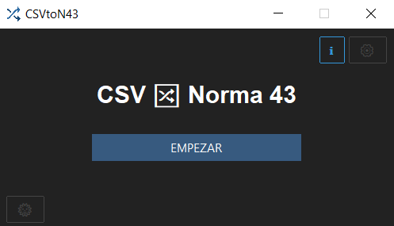
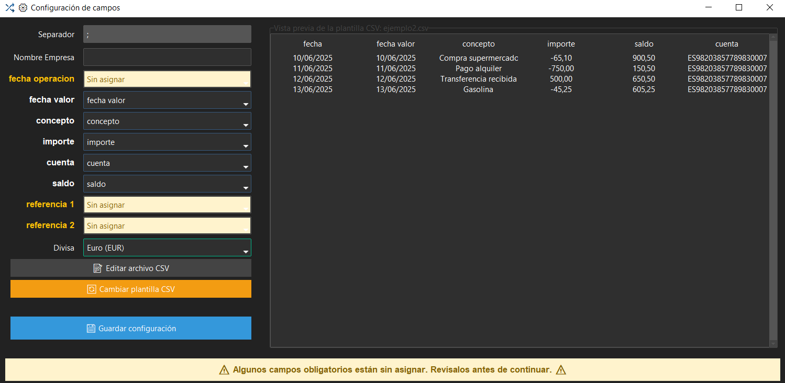
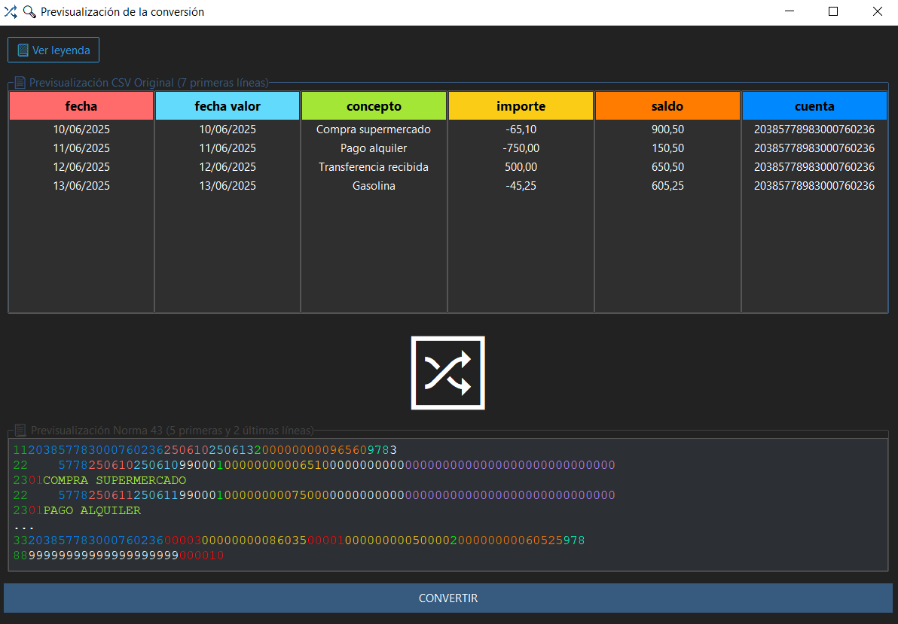

# 🧾 **CSVtoN43**  

Conversor de archivos CSV al formato bancario **Norma 43 (AEB43)**.

<p align="center">
  
</p>

---

## 🧩 Funcionalidad principal

- 🗃️ **Carga de archivos CSV** con movimientos bancarios.
- ⚙️ **Configuración interactiva de columnas** (fecha, importe, concepto…).
- 💱 **Selección de divisa** con asignación automática del código ISO 4217.
- 🧠 **Detección automática de campos comunes** como “fecha”, “importe”, “concepto”, etc.
- 🎨 **Previsualización con colores** para ver la equivalencia entre CSV y Norma 43.
- 🔄 **Conversión precisa a Norma 43**, conforme al estándar oficial.
- 📤 **Nombre automático del archivo exportado**, evitando sobrescrituras.
- 💾 **Compatibilidad con múltiples formatos de CSV** (separadores, codificación...).
- 🧪 **Validación de datos previa a la conversión** para evitar errores.
- 🌙 **Soporte de tema claro/oscuro** para mejor visualización.

---

## 📦 Última versión

> 🆕 **Versión actual: Build v3-030725**  
> - Nueva previsualización coloreada.  
> - Mejoras de rendimiento.  
> - Soporte para múltiples tipos de CSV.  
> - Configuración desacoplada y persistente.

---

## 🗂️ Estructura del proyecto

```text
📁 CSVtoN43/
├── 📁 images/
│   ├── 🖼️ cfg_wd.png
│   ├── 🖼️ main_wd.png
│   └── 🖼️ prev_wd.png
│
├── 📁 src/
│   ├── 📁 assets/                # Recursos gráficos como iconos, logotipos, etc.
│   │   └── 🖼️csv2n43.ico         # Icono de la aplicación
│   ├── 🛠️ config_gui.py          # Ventana de configuración de columnas y campos del CSV.
│   ├── 🔄 converter.py           # Lógica de conversión de datos desde CSV a Norma 43.
│   ├── 🧩 csv2n43_utils.py       # Funciones auxiliares para manejo de fechas, nombres, formatos, etc.
│   ├── ⚙️ CSVtoN43_CFG.json      # Configuración de la aplicación.
│   ├── 🖥️ CSVtoN43.py            # Interfaz principal de la aplicación con tkinter y ttkbootstrap.
│   ├── 📄 dist_README.md
│   ├── ℹ️ info_gui.py            # Ventana de información
│   ├── 👁️ preview_gui.py         # Ventana de previsualización con coloreado y comparación de datos.
│   └── 📄 requirements.txt       # Librerías necesarias para ejecutar el proyecto.
│
└── 📄 README.md
```

---

## 📖 Manual de usuario

---

### 🔹 1. Cargar archivo CSV

Al iniciar la aplicación:
- Pulsa **“EMPEZAR”** para seleccionar tu fichero CSV.
- Accede a la **configuración** mediante el botón ⚙️ o a la **información** con ℹ️.

📌 **Nota:** Si es la primera vez que usas la aplicación, se abrirá automáticamente la ventana de configuración para insertar una plantilla.

📷 *Interfaz principal:*  


---

### 🔹 2. Configurar campos (ventana ⚙️)

Selecciona un archivo CSV como plantilla. El sistema:

✅ **Detecta automáticamente campos conocidos** (`fecha`, `importe`, `concepto`, etc.)  
✅ Permite **editar o cambiar la plantilla CSV** desde tu editor predeterminado  
✅ Detecta el **separador** automáticamente (coma, punto y coma...)

🟦 **Consejo:**  
> Usa CSVs con encabezados bien nombrados para una configuración más rápida.

📷 *Configuración de campos:*  


---

### 🔹 3. Previsualizar conversión

Antes de exportar puedes:

- Ver las **7 primeras líneas del CSV original**
- Comprobar las **5 primeras y 2 últimas del archivo Norma 43**
- Colores que **vinculan visualmente los campos CSV ↔ Norma 43**
- Botón **“CONVERTIR”** para proceder a la generación

🟩 **Tip visual:**  
> Colores iguales = mismo campo = mayor seguridad de correspondencia.

📷 *Ejemplo de previsualización:*  


---

### 🔹 4. Exportar archivo Norma 43

Pulsa **“Guardar archivo Norma 43”**:

✅ Se genera el nombre automáticamente  
✅ Evita sobrescrituras  
✅ Puedes elegir la ubicación de guardado

🟥 **Aviso:**  
> Asegúrate de que todos los campos estén correctamente mapeados antes de exportar.

---

## 💻 Requisitos técnicos

- 🐍 Python **3.10.8**
- 💻 Sistema operativo: **Windows**
- 📦 Instalación de dependencias:

```bash
pip install -r requirements.txt
```

---

## 🛠️ Compilación (opcional)

### 📦 Usando **PyInstaller**

```bash
pyinstaller --noconsole --noconfirm --onedir --windowed --icon=assets/csv2n43.ico --name=CSVtoN43 CSVtoN43.py --collect-all ttkbootstrap --hidden-import=ttkbootstrap --noupx --add-data "assets/csv2n43.ico;assets"
```

### 📦 Usando **Nuitka**

```bash
python -m nuitka --standalone --enable-plugin=tk-inter --include-package-data=numpy --include-package-data=ttkbootstrap --include-data-file=assets/csv2n43.ico=assets/csv2n43.ico --windows-console-mode=disable --windows-icon-from-ico=assets/csv2n43.ico CSVtoN43.py
```

---

## 🔍 Estado del desarrollo

| Estado        | Descripción                                           |
|---------------|--------------------------------------------------------|
| ✅ Estable     | Funcionalidad básica completa y validada               |
| 🔧 En progreso | Mejoras de interfaz y validación automática de campos |
| 🧪 Testeo      | Con diferentes CSV reales de bancos españoles         |
